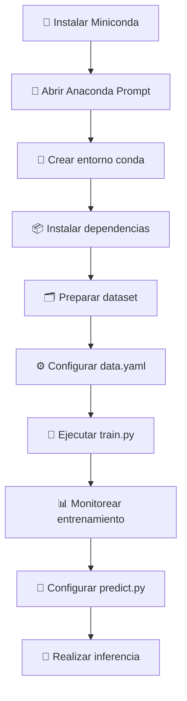

# YOLO-NAS para Detección de Documentos de Identidad

<div align="center">


</div>

## 📖 Descripción

Este repositorio contiene los recursos para entrenar un modelo de detección de objetos **YOLO-NAS** en un entorno local de Windows. El objetivo es crear un modelo capaz de localizar documentos de identidad en imágenes con alta precisión.

> 🎯 **Objetivo**: Detección automática de documentos de identidad en imágenes utilizando técnicas de Deep Learning

### ✨ Características

- ✅ Configuración optimizada para Windows
- ✅ Evita problemas de compilación comunes
- ✅ Utiliza Anaconda/Miniconda para gestión de dependencias
- ✅ Transfer Learning con pesos pre-entrenados COCO
- ✅ Interfaz de inferencia simple

---

## 📋 Tabla de Contenidos

- [⚙️ Instalación y Configuración del Entorno](#️-instalación-y-configuración-del-entorno)
- [🗂️ Preparación del Dataset](#️-preparación-del-dataset)
- [🚀 Fase 1: Entrenamiento del Modelo](#-fase-1-entrenamiento-del-modelo)
- [🔬 Fase 2: Comprobación y Predicción](#-fase-2-comprobación-y-predicción-inferencia)
- [💡 Resumen del Flujo de Trabajo](#-resumen-del-flujo-de-trabajo)

---

## ⚙️ Instalación y Configuración del Entorno

> ⚠️ **Importante**: Para una instalación limpia y sin errores, es crucial seguir estos pasos utilizando la terminal específica de Anaconda.

### 📋 Requisitos Previos

| Componente | Versión Recomendada | Link de Descarga |
|------------|-------------------|------------------|
| Miniconda | Última versión | [Descargar](https://docs.conda.io/en/latest/miniconda.html) |
| Python | 3.10 | Incluido con Miniconda |
| Sistema Operativo | Windows 10/11 | - |

### 📦 Pasos de Instalación

#### 1️⃣ Instalar Miniconda
```bash
# Descargar e instalar Miniconda para Windows desde su página oficial
# Asegúrate de marcar "Add to PATH" durante la instalación
```

#### 2️⃣ Abrir Anaconda Prompt
- Busca en el **Menú de Inicio**: `Anaconda Prompt (miniconda3)`
- 📝 **Nota**: Todos los comandos deben ejecutarse desde esta terminal

#### 3️⃣ Crear y Activar Entorno Virtual
```bash
# Crear nuevo entorno
conda create -n yolo-nas python=3.10 -y

# Activar entorno
conda activate yolo-nas
```

#### 4️⃣ Instalar Dependencias
```bash
# Instalar PyTorch y dependencias principales
conda install pytorch torchvision torchaudio pytorch-cuda=11.8 -c pytorch -c nvidia

# Instalar herramientas adicionales
conda install pycocotools onnx -c conda-forge

# Instalar super-gradients
pip install super-gradients
```

### ✅ Verificación de Instalación
```bash
python -c "import torch; print(f'PyTorch: {torch.__version__}')"
python -c "import super_gradients; print('Super Gradients instalado correctamente')"
```

---

## 🗂️ Preparación del Dataset

El modelo **YOLO-NAS** necesita que los datos estén organizados en una estructura específica para funcionar correctamente.

### 📁 Estructura de Carpetas Requerida

```
dataset/
├── images/
│   ├── train/          # Imágenes de entrenamiento
│   │   ├── img1.jpg
│   │   ├── img2.jpg
│   │   └── ...
│   └── val/            # Imágenes de validación
│       ├── img1.jpg
│       ├── img2.jpg
│       └── ...
└── labels/
    ├── train/          # Etiquetas de entrenamiento
    │   ├── img1.txt
    │   ├── img2.txt
    │   └── ...
    └── val/            # Etiquetas de validación
        ├── img1.txt
        ├── img2.txt
        └── ...
```

### 🏷️ Formato de Anotaciones YOLO

Cada imagen debe tener un archivo `.txt` correspondiente con el formato:

```
<class_id> <x_center> <y_center> <width> <height>
```

| Parámetro | Descripción | Rango |
|-----------|-------------|-------|
| `class_id` | Índice de la clase del objeto | 0, 1, 2, ... |
| `x_center` | Coordenada X del centro (normalizada) | 0.0 - 1.0 |
| `y_center` | Coordenada Y del centro (normalizada) | 0.0 - 1.0 |
| `width` | Ancho del bounding box (normalizado) | 0.0 - 1.0 |
| `height` | Alto del bounding box (normalizado) | 0.0 - 1.0 |

#### 📝 Ejemplo de Archivo de Etiquetas
```
0 0.5 0.3 0.4 0.6
1 0.2 0.7 0.3 0.25
```

### ⚙️ Archivo de Configuración `data.yaml`

Este archivo es **fundamental** para el entrenamiento. Define la estructura del dataset:

```yaml
# data.yaml
path: /path/to/dataset  # Ruta raíz del dataset
train: images/train     # Ruta relativa a imágenes de entrenamiento
val: images/val         # Ruta relativa a imágenes de validación

# Número de clases
nc: 2

# Nombres de las clases
names:
  0: documento_identidad
  1: otro_documento
```

> ⚠️ **Crítico**: El valor `nc` debe coincidir exactamente con el número de clases en tu dataset.

---

## 🚀 Fase 1: Entrenamiento del Modelo

El entrenamiento se gestiona a través del script `train.py`, que está optimizado para **YOLO-NAS**.

### 🔧 Configuración del Entrenamiento

El script `train.py` está configurado para:

| Funcionalidad | Descripción |
|---------------|-------------|
| 📂 **Carga de Dataset** | Utiliza la información del archivo `data.yaml` |
| 🏗️ **Arquitectura del Modelo** | Construye YOLO-NAS con el número correcto de clases |
| 🎯 **Transfer Learning** | Carga pesos pre-entrenados del dataset COCO |
| ⚙️ **Hiperparámetros** | Define épocas, learning rate y función de pérdida |
| 💾 **Guardado** | Guarda checkpoints y resultados automáticamente |

### ▶️ Ejecutar Entrenamiento

```bash
# Activar el entorno
conda activate yolo-nas

# Navegar al directorio del proyecto
cd /path/to/trainYoloNas

# Iniciar entrenamiento
python train.py
```

### 📊 Parámetros de Entrenamiento

```python
# Ejemplo de configuración en train.py
EPOCHS = 100
BATCH_SIZE = 16
LEARNING_RATE = 0.001
NUM_CLASSES = 2  # ⚠️ Debe coincidir con data.yaml
```

### 📈 Monitoreo del Progreso

Durante el entrenamiento verás:
- 📉 **Loss curves**: Pérdida de entrenamiento y validación
- 📊 **Métricas**: mAP, Precision, Recall
- 💾 **Checkpoints**: Modelos guardados automáticamente
- 📁 **Logs**: Registros detallados del progreso

---

## 🔬 Fase 2: Comprobación y Predicción (Inferencia)

Una vez entrenado el modelo, utiliza el script `predict.py` para realizar detecciones en imágenes nuevas.

### ⚙️ Configuración de Parámetros

Antes de ejecutar la inferencia, configura estos **3 parámetros críticos**:

#### 📁 1. Ruta del Checkpoint
```python
# Ejemplo en predict.py
MODEL_PATH = "/absolute/path/to/best_model.pth"
```

#### 🏷️ 2. Número de Clases
```python
# ⚠️ DEBE coincidir con el entrenamiento
NUM_CLASSES = 2
```

#### 🎯 3. Umbral de Confianza
```python
# Valor entre 0.0 y 1.0
CONFIDENCE_THRESHOLD = 0.2  # Empezar con valor bajo para testing
```

### 📋 Tabla de Configuración

| Parámetro | Descripción | Valor Recomendado | Notas |
|-----------|-------------|------------------|-------|
| `MODEL_PATH` | Ruta absoluta al archivo `.pth` | `/full/path/to/model.pth` | Usar ruta completa |
| `NUM_CLASSES` | Número de clases del modelo | `2` | Debe coincidir con entrenamiento |
| `CONFIDENCE_THRESHOLD` | Umbral mínimo de confianza | `0.2` - `0.5` | Empezar bajo para validar |

### ▶️ Ejecutar Predicción

```bash
# Activar el entorno
conda activate yolo-nas

# Navegar al directorio
cd /path/to/trainYoloNas

# Configurar predict.py con los parámetros correctos
# Luego ejecutar:
python predict.py
```

### 🖼️ Resultado Esperado

El script mostrará:
- 🖼️ **Imagen original** con bounding boxes
- 🏷️ **Etiquetas** de las clases detectadas
- 📊 **Scores de confianza** para cada detección
- 📏 **Coordenadas** de los bounding boxes

---

## 💡 Resumen del Flujo de Trabajo

### 🔄 Workflow Completo



### 📋 Checklist de Comandos

#### ✅ Configuración Inicial
```bash
# 1. Activar entorno
conda activate yolo-nas

# 2. Navegar al proyecto
cd /Users/sergiobanuls/Documents/YOLO-NAS/trainYoloNas
```

#### ✅ Entrenamiento
```bash
# 3. Entrenar modelo
python train.py
```

#### ✅ Inferencia
```bash
# 4. Hacer predicciones (después de configurar predict.py)
python predict.py
```

### 🛠️ Solución de Problemas Comunes

| Problema | Solución |
|----------|----------|
| ❌ **Error de compilación** | Usar Anaconda Prompt exclusivamente |
| ❌ **Error de clases** | Verificar `nc` en `data.yaml` |
| ❌ **Error de checkpoint** | Usar ruta absoluta en `predict.py` |
| ❌ **Dependencias faltantes** | Reinstalar con conda/pip según instrucciones |

### 📞 Soporte

Si encuentras problemas:
1. 📖 Revisa este README paso a paso
2. 🔍 Verifica que todos los archivos estén en su lugar
3. ⚙️ Confirma que el entorno conda esté activado
4. 📝 Comprueba los logs de error en la terminal

---

<div align="center">

### 🎉 ¡Listo para Detectar Documentos de Identidad!

**Desarrollado con ❤️ para detección de objetos con YOLO-NAS**

</div>